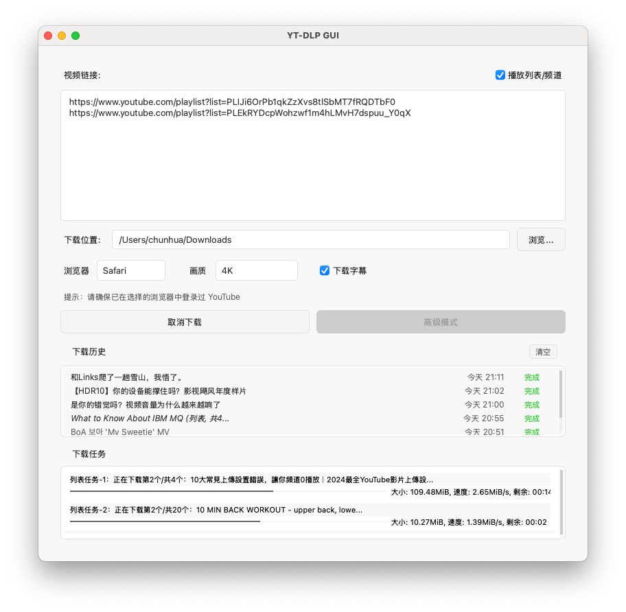

# YT-DLP GUI for macOS

YT-DLP GUI 是一款简单易用的 YouTube 下载器，为命令行工具 `yt-dlp` 提供直观图形界面，面向不熟悉终端的小白用户也能一键下载高质量视频。
- 支持单视频与播放列表/频道批量下载
- 一键选择画质（含 4K/8K）或仅下载 MP3 音频，支持字幕下载
- 基础模式够用，高级模式可自定义音视频编码与格式
- 下载历史与进度可视化，便捷打开文件/所在文件夹

## 软件截图

### 基础模式-1


### 基础模式-2


## 安装与首次运行

1) 系统要求
- macOS 10.15 或更高；支持 Intel 与 Apple Silicon (M 系列)

2) 安装应用（<span style="color:red">推荐：DMG 安装</span>）
- 打开 <a href="https://github.com/luluyayawawa123/yt-dlp-gui/releases" target="_blank" rel="noopener noreferrer">Releases 页面</a>，下载 DMG：`YT-DLP-GUI-mac-v*.dmg`
- 双击打开 DMG，将“YT-DLP GUI”<span style="color:red">拖拽到“应用程序（Applications）”文件夹</span>完成安装（DMG 窗口通常自带 Applications 快捷方式，把图标拖到那个文件夹图标上即可）
- 备用方式：如需 ZIP，可下载 `YT-DLP-GUI-mac-v*.zip`，解压后将“YT-DLP GUI”拖入“应用程序（Applications）”文件夹

3) 首次运行（<span style="color:red">必读</span>）
- 由于来自未公证开发者，首次运行时会被系统拦截：
  - 打开“系统设置（System Settings）” → “隐私与安全性（Privacy & Security）”，在“安全性”中找到被拦截的“YT-DLP GUI”，点击<span style="color:red">“仍要打开（Open Anyway）”</span>
  - 或右键“YT-DLP GUI”选择“打开（Open）”
- 首次使用会请求“完全磁盘访问”以读取浏览器 cookies 并保存下载文件：打开“系统设置” → “隐私与安全性” → “完全磁盘访问”，添加并开启本应用后重启应用
- <span style="color:red">重要提醒：</span>本应用在 Intel Mac 上开发，M 系列 Mac 运行时可能需要 Rosetta 翻译，首次或每次启动可能需等待约 10 秒，请耐心等待

4) 安装必要的依赖（<span style="color:red">很重要！！</span>）
```bash
# 安装 Homebrew（若尚未安装）
/bin/bash -c "$(curl -fsSL https://raw.githubusercontent.com/Homebrew/install/HEAD/install.sh)"

# 安装/更新依赖（建议定期升级以适配 YouTube）
brew update
brew install yt-dlp ffmpeg   # 首次安装
brew upgrade yt-dlp ffmpeg   # 已安装时升级

# 验证版本
yt-dlp --version
ffmpeg -version | head -n 1
```

<span style="color:red">遇到“无法解析/403/No formats found”等下载失败时，请先用 Homebrew 更新 yt-dlp 与 ffmpeg 后再试。</span>


## 使用说明

基础模式（推荐）
1. 打开应用，在“浏览器”处选择 cookies 来源：Safari（推荐）/Chrome/Edge
   - <span style="color:red">必须先在所选浏览器中登录 YouTube 账号</span>（下载会员/受限视频需要登录）
2. 将一个或多个 YouTube 视频/播放列表/频道链接粘贴到输入框（每行一个）
3. 选择下载目录
4. 画质选择：保持“最高画质”即可下载可用的最高分辨率（可达 4K/8K）；也可以选择 1080P、480P 画质；若仅需音频请选择“仅MP3音频”
5. 如需下载字幕，勾选“下载字幕”（自动转换为 SRT）。只会下载视频博主上传的高质量字幕，不会下载 YouTube 系统自动生成的低质量字幕
6. 点击“开始下载”，在下方查看实时进度；下载完成后可以在下载历史列表中通过右键——打开文件或所在文件夹或直接打开视频。

高级模式（可选）
- 先点击“分析格式”，查看可用的视频/音频编码与清晰度
- 在“格式”中自定义组合（例如选择更通用的 `webm/AV1 + m4a` 以提升 4K 命中率）
- 适合对格式/编码有更细需求的用户

提示
- 部分视频的 4K 仅提供 WebM/AV1 视频流，如默认模式未能抓取 4K，可在高级模式放宽格式限制后重试

## 常见问题

1. <span style="color:red"><strong>下载失败/报错（无法解析、403、No formats found 等）</strong></span>
   - 可能原因：YouTube 会不定期升级和调整页面/接口，导致旧版本的 yt-dlp 无法适配。
   - 建议优先更新依赖（通过 Homebrew）：
     ```bash
     # 更新 Homebrew 索引
     brew update

     # 升级 yt-dlp 和 ffmpeg 到最新稳定版
     brew upgrade yt-dlp ffmpeg

     # 若仍有问题可尝试重装
     brew reinstall yt-dlp ffmpeg

     # 验证版本
     yt-dlp --version
     ffmpeg -version | head -n 1
     ```
   - 说明：若是通过 Homebrew 安装的 yt-dlp，不建议使用 `yt-dlp -U` 自更新，请使用上面的 `brew update/upgrade`。
   - 若更新后仍失败：
     - 可能是上游规则仍在修复中，可稍后再试。
     - 尝试更换网络或代理环境，排除本地网络限制。
     - 在高级模式中查看详细日志，便于定位问题。

2. **提示“未找到 yt-dlp”**
   - 重新安装依赖：`brew reinstall yt-dlp`
   - 验证安装：`which yt-dlp`

3. **无法下载会员视频**
   - 检查浏览器是否已登录
   - 确认已授予完全磁盘访问权限

4. **应用无法启动**
   - 确保已安装全部依赖
   - 尝试右键点击选择“打开”

## 调试
- 日志路径：`~/Library/Application Support/YT-DLP-GUI/debug.log`
- 包含：
  - 系统环境信息
  - 命令执行记录
  - 错误详情等信息
